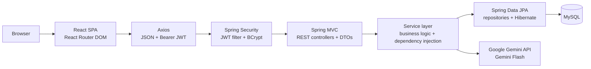

# Namma Tulunadu

Namma Tulunadu is a Coastal Karnataka tourism application. Its browser client is a React single-page app and its API is a Java 21 Spring Boot application backed by MySQL. The Java API owns authentication, persistence, and server-side Google Gemini calls; the frontend never receives database credentials, JWT signing keys, or Gemini API keys.

## Technology

| Area | Technologies |
| --- | --- |
| Frontend | React, JavaScript (ES6+), JSX, HTML5, CSS3, React Router DOM, Axios, Vite |
| Backend | Java 21, Spring Boot, Spring MVC, Spring Data JPA, Hibernate, Spring Security, JWT, BCrypt, REST, Maven |
| Database | MySQL |
| AI | Google Gemini API; configurable Gemini Flash model |
| Developer tools | npm, Maven, Postman, VS Code or IntelliJ IDEA, Git and GitHub |

The frontend's npm/Vite toolchain uses the JavaScript runtime required by Vite. It does not run application API routes or a separate JavaScript backend; all application APIs are implemented in Spring Boot.

## Architecture



Backend code is organized as `controller → service → repository`. Entities map to MySQL through JPA/Hibernate. Authentication and AI requests use validated DTOs, JWT login uses a response DTO, and successful API responses use the shared `ApiResponse` envelope; some existing catalog and administration endpoints still serialize entity data inside that envelope. See [docs/architecture.md](docs/architecture.md) for the detailed architecture and security flows, and [docs/api.md](docs/api.md) for the endpoint reference.

## Prerequisites

- Java 21 JDK
- Maven 3.9 or later
- MySQL 8
- npm and a Node.js runtime compatible with the installed Vite version (frontend development/build tooling only)
- Git

Postman is recommended for exercising the API. VS Code and IntelliJ IDEA are supported editor choices.

## Local setup

1. Create a MySQL account and database. The JDBC URL in the example creates `tulunadu_db` if the configured MySQL user is allowed to do so.
2. Copy `.env.example` to `.env` in the project root. Set `DB_USERNAME` and `DB_PASSWORD` for your MySQL account and replace `JWT_SECRET` with a private random value at least 32 characters long. Never commit `.env`.
3. To enable the AI assistant, provide a Google AI Studio API key in `GEMINI_API_KEY` and set `GEMINI_MODEL` to a Gemini Flash model enabled for that key/project. The sample is `gemini-2.5-flash`. Provider quota or billing limits can prevent responses even when the application is configured correctly.
4. In a terminal at the project root, start Spring Boot:

   ```powershell
   npm run start
   ```

   The launcher selects a Java 21 JDK and starts the Maven Spring Boot application on port `8080`. It loads the project-root `.env`.

5. In a second terminal at the project root, install frontend packages (once) and start Vite:

   ```powershell
   npm --prefix frontend install
   npm run dev:frontend
   ```

   Open `http://localhost:3000`. The default API base URL is `http://localhost:8080/api/v1`. To use another API URL, copy `frontend/.env.example` to `frontend/.env.local`, edit `VITE_API_URL`, and restart Vite.

Spring initializes the MySQL schema and sample seed records from the backend resources. MySQL must be running and reachable before the backend starts. Do not replace the database with an in-memory database for normal development.

## Configuration

Backend settings are read from environment variables (or the ignored project-root `.env` for local development):

| Variable | Required | Purpose |
| --- | --- | --- |
| `DB_URL` | Yes | MySQL JDBC URL |
| `DB_USERNAME` | Yes | MySQL user |
| `DB_PASSWORD` | Yes | MySQL password; it may be blank only if that MySQL account has no password |
| `JWT_SECRET` | Yes | Private signing key, at least 32 characters |
| `JWT_EXPIRATION_MS` | No | JWT lifetime in milliseconds |
| `GEMINI_API_KEY` | For AI | Google Gemini API key; never expose it to the browser |
| `GEMINI_MODEL` | For AI | Flash model available to the configured API key/project |
| `CORS_ALLOWED_ORIGINS` | No | Comma-separated frontend origins; local ports 3000 and 5173 are allowed |
| `ADMIN_USERNAME`, `ADMIN_EMAIL`, `ADMIN_PASSWORD` | Optional | Set all three to create/configure the initial administrator; the password must be at least 8 characters |

The frontend variable `VITE_API_URL` is a public API base URL, not a secret. Never put credentials or signing keys in `VITE_*` variables.

## Build and test

Run from the project root:

```powershell
npm test
npm run build:frontend
```

`npm test` runs the Java backend test suite through the Java 21 launcher. `npm run build:frontend` creates the production frontend in `frontend/dist`.

## Deployment

1. Provision MySQL and configure the backend environment variables in the hosting platform's secret/configuration manager. Do not deploy the development `.env` file.
2. Build the backend with Java 21 and Maven:

   ```powershell
   mvn -f backend/pom.xml clean package
   ```

   Deploy `backend/target/tulunadu-tourism-service-1.0.0.jar` to a Java 21 runtime and start it with `java -jar`. Make the database and Gemini API reachable from the backend host.
3. Set `VITE_API_URL` to the deployed Spring API base URL when building the frontend, then run `npm run build:frontend`. Host the contents of `frontend/dist` on a static web host/CDN configured to fall back to `index.html` for React Router routes.
4. Set `CORS_ALLOWED_ORIGINS` to the exact HTTPS origin(s) serving the frontend. Terminate TLS at the production ingress/reverse proxy and expose only the required API and static web ports.

There is no separate JavaScript API server to deploy.

## Project layout

```text
backend/
  src/main/java/com/tulunadu/tourism/
    config/       Spring and security configuration
    controller/   REST endpoints
    dto/          Validated request and response objects
    model/        JPA entities
    repository/   Spring Data JPA repositories
    security/     JWT authentication and user details
    service/      Business logic and Gemini integration
  src/main/resources/
    application.properties
    schema.sql
    data.sql
frontend/
  src/
    components/   React UI
    context/      Authentication state
    data/         Curated tourism catalog
    services/     Axios API client
  public/images/  Static destination imagery
docs/
  api.md
  architecture.md
scripts/
  start-backend.ps1
```

## Developer notes

- Keep browser/API URLs in `VITE_API_URL`; database, JWT, and Gemini secrets belong only in backend configuration.
- Protect user-owned API resources with JWT authentication and derive ownership from the authenticated principal.
- Keep validation in request DTOs and business rules in services; repository classes handle persistence.
- Add/update endpoint documentation in [docs/api.md](docs/api.md) alongside controller changes.
- For API checks in Postman, log in and use the returned `token` as a Bearer token for protected endpoints.
- The current CORS configuration includes both Vite's default origin and the configured frontend origin; production origins must be configured explicitly.
