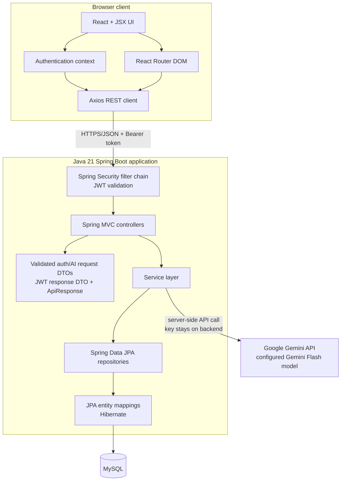
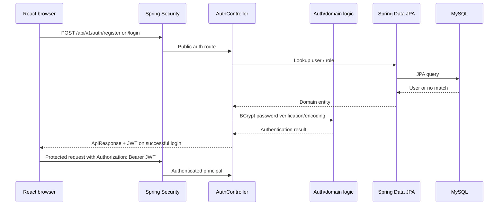
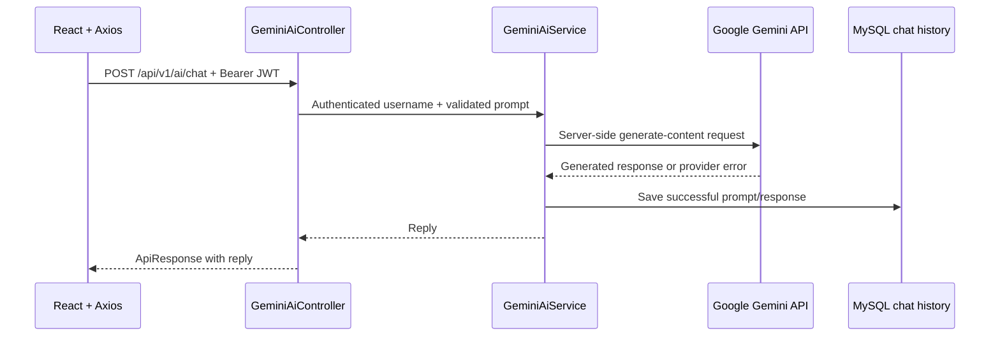

# Architecture

## Component view

The backend is a layered Spring Boot application, not a set of independently deployed services. Spring dependency injection supplies services and repositories to the controllers. Spring Data JPA/Hibernate maps entity operations to MySQL.

Authentication and AI input use validated request DTOs; login uses a JWT response DTO, and successful responses share the `ApiResponse` envelope. Some existing catalog and administration responses (and a few request bodies) still use entity objects within that envelope; new endpoints should use dedicated DTOs, and further entity/DTO separation should be introduced without changing the established API contract unintentionally.

## Request flows

### Registration and login

Password hashes are stored with BCrypt. JWT validation is stateless; authorization and user ownership are enforced by the backend.

### Gemini request

Gemini API keys are loaded only by Spring Boot. Quota/rate limits are provider-side and are reported as request errors rather than fabricated responses.

## Code boundaries

| Package | Responsibility |
| --- | --- |
| `controller` | Spring MVC routes, HTTP status, request/response orchestration |
| `dto` | Validated API requests and response envelopes |
| `service` | Application rules, authorization ownership checks, external Gemini calls |
| `repository` | Spring Data JPA persistence interfaces |
| `model` | Hibernate/JPA entity mappings |
| `security` | JWT filter, token utilities, and authenticated user details |
| `config` | Spring Security, CORS, and application configuration |

The React app talks only to the versioned Spring REST API. Vite serves the frontend during development and produces static files for production; it is not an application API server.
